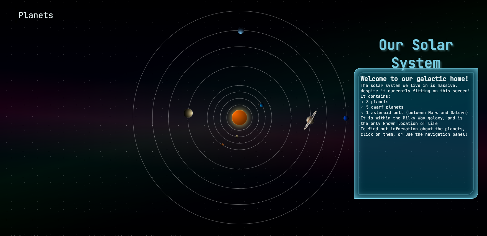
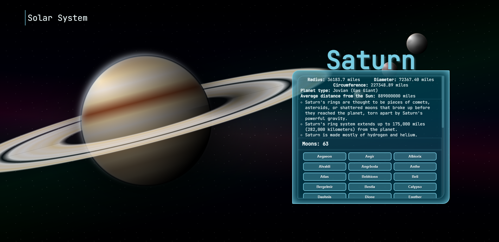
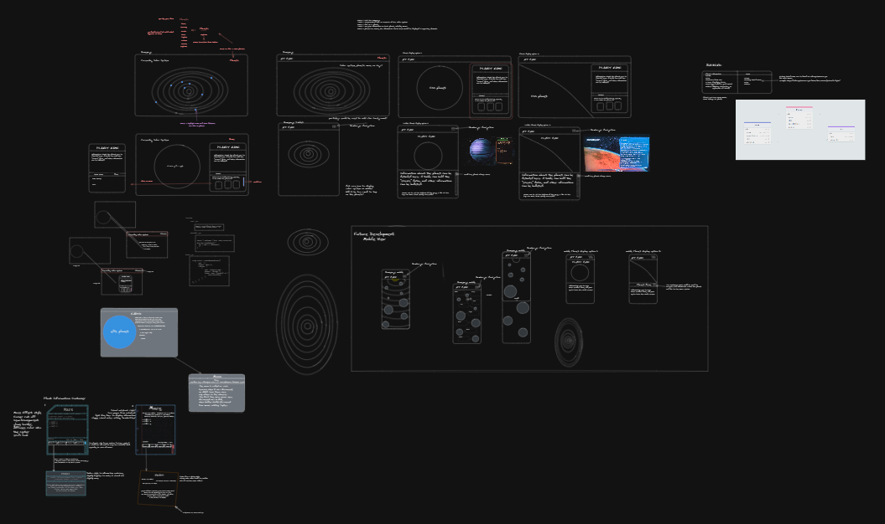

# Cascading Solar System

An educational website intended to teach students about the solar system we live in. The Sun, eight plants and their moons are included, with various information about them provided.

## [Live Demo](https://cascading-solar-system.herokuapp.com/ "Cascading Solar System")

## Run Locally

```javascript
> git clone https://github.com/Ccatalyst/Cascading-Solar-System.git
> ensure your mySQL server is running
> npm install
```

Navigate to the client directory and rename the .env.EXAMPLE file to .env.

Navigate to the server directory and rename the .env.EXAMPLE file to .env.

Open the server .env file and enter your mySQL server login information:

```javascript
DB_USER = "<your username>";
DB_PASSWORD = "<your password>";
DB_NAME = "solar_system_db";
```

Navigate back to the root directory of the application and run:

```javascript
>npm run seed
>npm run develop
```

The server will run on `localhost:3001` by default, and the react application will run on `localhost:3000` by default.

## Technology Summary

We have a mySQL database running on an express server, with Sequelize handling the routing to the database. The react application uses react-router-dom to navigate to the planet pages, as well as query the server upon navigation. The site's font is Jetbrains mono, via the fontsource node package.

<details>
<summary><h3><strong>Technical Requirements</strong></h3></summary>

 <h4>Planets:</h4>
    <ul>
        <li>Each planet of the solar system must have its own profile page.</li>
            <ul>
                <li>Navigating to a planet changes the URL and displays the planet associated with that url endpoint</li>
            </ul>
        <li>
            Each page must include at a minimum (Name of the planet, size, distance from the Sun, three identifying facts, solid or gas core, and a visual representation of the planet)
            NOTE: No images, assets, emojis, or SVGs are permitted. The visual representation of each planet must be made ENTIRELY out of CSS.
        </li>
            <ul>
                <li>
                    All data has been provided, and the planet is rendered with pure CSS. Shout out to Eli for the killer planets.
                </li>
            </ul>
        <li>
            If the planet has a moon, you must display the following information for every moon (Name, history behind name, and size). 
        </li>
            <ul>
                <li>
                    A custom button component is rendered for each moon, and when the button is clicked a modal is rendered on top of the current page with the required information about the moon. Clicking on the outside of the modal, or hitting the escape key on your keyboard will close the modal.
                </li>
            </ul>
        <li>
            Planet pages must include at least two different components that are NOT used on your homepage.
        </li>
            <ul>
                <li>
                A panel that shows the details of the planet is rendered, as well as a button for the moons. The button can be clicked to show a modal with information on the moon that was clicked.
                </li>
            </ul>
        <li>
            If a planet has more than one moon, the moon information must be displayed in repeating elements.
        </li>
            <ul>
                <li>
                The moons for a planet are mapped over, and a button component is rendered for each of them.
                </li>
            </ul>
        <li>
        All planet and moon content MUST be stored in a database.
        </li>
    </ul>
<h4>
    Backend:
</h4>
<ul>
    <li>
        You must use foreign keys.
    </li>
        <ul>
            <li>
                Foreign keys that link to the planet table's primary key are on both the facts table and the moons table.
            </li>
        </ul>
    <li>
        Planets and Moons must be stored separate from one another.
    </li>
            <ul>
                <li>
                    Planets, Moons, and Facts are all stored separately from one another and linked via foreign keys
                </li>
            </ul>
    <li>
        You must incorporate one ENUM for the planet data.
    </li>
        <ul>
            <li>
                The core type of the planet is an ENUM with three options: "Terrestrial", "Jovian (Gas Giant)", and "Jovian (Ice Giant)"
            </li>
        </ul>
</ul>
<h4>
    Homepage:
</h4>
<ul>
    <li>
        The homepage should be an overview of the solar system.
    </li>
        <ul>
            <li>
                A solar system component with the planets orbiting the sun is displayed, and information about the solar system is provided in a panel. The planets in the solar system can be clicked on to navigate to their pages, or a drop-down navigation can be used instead. The planets can be selected by using tab.
            </li>    
        </ul>
    <li>
        The data included will be up to each team.
    </li>
        <ul>
            <li>
                Basic information on the solar system is provided in the panel on the home page.
            </li>    
        </ul>
    <li>
        The homepage must include at least two components that are NOT used on any planet page.
    </li>
        <ul>
            <li>
                The solar system component is not used on the planet page, and the panel displaying information about the solar system is independent of the panel of the planet page, but does have the same styling applied to it.
            </li>    
        </ul>
</ul>
</details>

## Screenshots




## Sources

The information about our solar system and it's bodies were collected from NASA's Solar System Exploration: Our Galactic Neighborhood. More information can be found at their website:

[Solar System Exploration: Our Galactic Neighborhood - NASA](https://solarsystem.nasa.gov/ "Solar System Exploration: Our Galactic Neighborhood")

## License

This project is licensed under the [MIT copyright license](./LICENSE "MIT copyright license").

## Contact Information

If you have any questions, please reach out via an email to one of us!

[Matthew Todor](todor.matthew.john@gmail.com "Matthew Todor")

[Eli Wood](contact.eliwood@gmail.com "Eli Wood")

[Jason Duran](jasonduran303@gmail.com "Jason Duran")

### Wire Frame:


